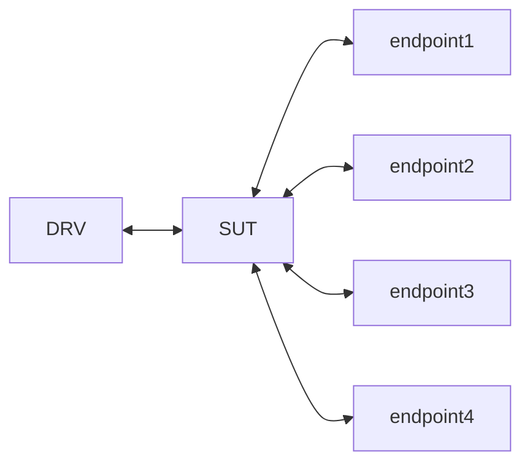

# AWS nginx setup
**NOTE**: you will see `mawstool` mentioned. This is my own tool which you can find at https://github.com/mitchdz/mitch-awstool

## Introduction
This repository shows how to setup an arm based nginx server using Ubuntu Focal using AWS EC2 instances.

This repository was made to document the setup for https://bugs.launchpad.net/ubuntu/+source/nginx/+bug/2024019

---

The resulting Setup will look like this:
| Machine Type | Machine Name | AMI | Arch | release | purpose |
| -------- | -------- | -------- | -------- | ------ | ----- |
| m6g.metal | SUT | ami-0bd8fea7bacfec62d | arm64 |focal-server | nginx server |
| c5n.9xlarge | DRV | ami-010b74bc1a8b29122 | amd64 | focal-server | Initiates workload |
| c5.4xlarge | endpoint1 | ami-010b74bc1a8b29122 | amd64 | focal-server | nodejs endpoint |
| c5.4xlarge | endpoint2 | ami-010b74bc1a8b29122 | amd64 | focal-server | nodejs endpoint |
| c5.4xlarge | endpoint3 | ami-010b74bc1a8b29122 | amd64 | focal-server | nodejs endpoint |
| c5.4xlarge | endpoint4 | ami-010b74bc1a8b29122 | amd64 | focal-server | nodejs endpoint |

Where each machine interacts like this




## Set up placement group && security group

Set these up beforehand in the aws console.

I enabled all traffic to/from anywhere for the securitygroup for testing. Don't do this in production.


## Create the instances

You can find the AMI to use either through the aws console or with awscli. For example:

```bash
$ mawstool get_latest_ami --release focal --aws_arch arm64
ami-0bd8fea7bacfec62d
```
OR
```bash
$ aws ec2 describe-images --owners 099720109477 --region eu-north-1 --filters 'Name=name,Values=ubuntu/images/*focal*arm64*' --query 'Images[*].[ImageId,CreationDate,Name]' --output text | sort -k2 -r | head -n1 | awk '{print $1}'
ami-0bd8fea7bacfec62d
```
Pay attention to the `instance-type`, as that's different for the endpoints,DRV,SUT.

### endpoints
```bash
aws ec2 run-instances \
    --image-id ami-010b74bc1a8b29122 \
    --count 1 \
    --instance-type c5.4xlarge \
    --key-name mitchell \
    --placement GroupName=nginx_atomics \
    --security-group-ids sg-0c8f053b49a29edb8 \
    --region eu-north-1 \
    --tag-specifications 'ResourceType=instance,Tags=[{Key=Name,Value=mitchdz-nginx-endpoint1}]' \
    --block-device-mappings '[{"DeviceName":"/dev/sda1","Ebs":{"VolumeSize":24,"VolumeType":"gp2"}}]'
```
Repeat this for all 4 endpoints.
### DRV
```bash
aws ec2 run-instances \
    --image-id ami-010b74bc1a8b29122 \
    --count 1 \
    --instance-type c5n.9xlarge \
    --key-name mitchell \
    --placement GroupName=nginx_atomics \
    --security-group-ids sg-0c8f053b49a29edb8 \
    --region eu-north-1 \
    --tag-specifications 'ResourceType=instance,Tags=[{Key=Name,Value=mitchdz-nginx-DRV}]' \
    --block-device-mappings '[{"DeviceName":"/dev/sda1","Ebs":{"VolumeSize":24,"VolumeType":"gp2"}}]'
```


### SUT
```bash
aws ec2 run-instances \
    --image-id ami-0bd8fea7bacfec62d \
    --count 1 \
    --instance-type m6g.metal \
    --key-name mitchell \
    --placement GroupName=nginx_atomics \
    --security-group-ids sg-0c8f053b49a29edb8 \
    --region eu-north-1 \
    --tag-specifications 'ResourceType=instance,Tags=[{Key=Name,Value=mitchdz-nginx-SUT}]' \
    --block-device-mappings '[{"DeviceName":"/dev/sda1","Ebs":{"VolumeSize":24,"VolumeType":"gp2"}}]'
```

## Set up the endpoint instances
On all of the instances, run the following setup:

```bash
# Install NodeJS
wget https://nodejs.org/dist/v10.15.3/node-v10.15.3-linux-x64.tar.xz
tar xf node-v10.15.3-linux-x64.tar.xz

# Install dependencies
export PATH="/home/ubuntu/node-v10.15.3-linux-x64/bin/:$PATH"
/home/ubuntu/node-v10.15.3-linux-x64/bin/npm install express cluster

# Web app code
cat > app.js << 'EOF'
const express = require('express')
const cluster = require('cluster');
const numCPUs = require('os').cpus().length;
const app = express()
const port = 3000

if (cluster.isMaster) {
  for (var i = 0; i < numCPUs; i++) {
    cluster.fork();
  }
} else {
  app.get('/', (req, res) => {
    res.send('Hello World!')
  })
  app.listen(port, () => {
    console.log(`Example app listening on port ${port}`)
  })
}
EOF

# Run Web app and leave it open
nohup /home/ubuntu/node-v10.15.3-linux-x64/bin/node /home/ubuntu/app.js &
```

## Set up ARM64 focal SUT instance

Get the enpoint IPs (these are the private IPs)
```bash
$ mawstool list | grep endpoint | awk '{print "     server " $5 ":3000;"}'
     server 172.31.46.191:3000;
     server 172.31.36.229:3000;
     server 172.31.41.37:3000;
     server 172.31.32.230:3000;
```
Note the endpoints for setting up the nginx conf.

Run the following on the SUT:
```bash
$ mawstool ssh -n mitchdz-nginx-SUT
$ sudo apt update && sudo apt install -y \
    nginx-full \
    linux-tools-5.15.0-1055-aws \
    linux-tools-aws \
    linux-tools-common
$ cat  << 'EOF' | sudo tee /etc/nginx/sites-enabled/default
 log_format  main  '$remote_addr - $remote_user [$time_local] "$request" '
                   '$status $body_bytes_sent "$http_referer" '
                   '"$http_user_agent" "$http_x_forwarded_for"';
 access_log  /var/log/nginx/access.log  main buffer=8k ;

 proxy_next_upstream off;
 proxy_redirect off;
 keepalive_requests 10000;
 client_max_body_size 0;
 proxy_request_buffering off;
 proxy_http_version 1.1;
 proxy_set_header Connection "";
 proxy_set_header Proxy-Authenticate "";
 proxy_set_header Proxy-Authorization "";
 proxy_buffers 8 8k;
 proxy_buffer_size 32k;
 proxy_buffering off;
 proxy_busy_buffers_size 32k;
 proxy_max_temp_file_size 0m;

 # Change IPs
 upstream backend {
     server 172.31.46.191:3000;
     server 172.31.36.229:3000;
     server 172.31.41.37:3000;
     server 172.31.32.230:3000;
     keepalive_requests 1000000;
     keepalive 128;
 }

 server {
     listen       80 default_server reuseport fastopen=128;
     server_name  _;
     root         /usr/share/nginx/html;
     include /etc/nginx/default.d/*.conf;

     location / {
         proxy_pass http://backend;
     }
     error_page 404 /404.html;
         location = /40x.html {
     }
     error_page 500 502 503 504 /50x.html;
         location = /50x.html {
     }
 }
EOF
```
Update the upstream backend IPs if needed.

```bash
sudo systemctl restart nginx && sudo systemctl status nginx | head
```

## Set up the DRV instance

```bash
sudo apt update && sudo apt install -y git make build-essential unzip 
cd && git clone https://github.com/wg/wrk.git
cd ~/wrk ; make -j`nproc` 
```

## Running the test
Run the test on the DRV instance (IP is SUT private IP)
```bash
$ ./wrk/wrk -t36 -c512 -d60s http://172.31.33.24:80/
```


While running the test, run the following on the SUT
```bash
sudo perf record -a -e r6e sleep 20s
sudo perf report -i perf.data
```

## Example results:
```
[DRV]
$ ./wrk/wrk -t36 -c512 -d60s http://172.31.33.24:80/
Running 1m test @ http://172.31.33.24:80/
36 threads and 512 connections
Thread Stats Avg Stdev Max +/- Stdev
Latency 2.37ms 1.49ms 57.15ms 92.45%
Req/Sec 5.79k 447.78 21.25k 82.70%
12459660 requests in 1.00m, 2.87GB read
Non-2xx or 3xx responses: 2
Requests/sec: 207318.45
Transfer/sec: 48.84MB

[SUT]
$ sudo perf record -a -e r6e sleep 20s
[ perf record: Woken up 156 times to write data ]
[ perf record: Captured and wrote 46.873 MB perf.data (864759 samples) ]
$ sudo perf report -i perf.data
Samples: 864K of event 'r6e', Event count (approx.): 13434772
Overhead Command Shared Object Symbol
33.23% nginx nginx [.] ngx_http_create_request
32.89% nginx nginx [.] ngx_reusable_connection
32.48% nginx nginx [.] ngx_http_process_request
```

## Extras
### Ensuring all instances are in the same placement group
```
$ aws ec2 describe-instances --query 'Reservations[*].Instances[*].[InstanceId, Tags[?Key==`Name`].Value | [0], Placement.GroupName]' --output table

---------------------------------------------------------------------
|                         DescribeInstances                         |
+---------------------+---------------------------+-----------------+
|  i-0db0e26ea5cb59a3e|  mitchdz-nginx-endpoint3  |  nginx_atomics  |
|  i-04b52455677a5000f|  mitchdz-nginx-DRV        |  nginx_atomics  |
|  i-0995d8e288337b096|  mitchdz-nginx-endpoint1  |  nginx_atomics  |
|  i-0b1f26a5926d19b81|  mitchdz-nginx-SUT        |  nginx_atomics  |
|  i-0ae1dfe9f522cae0f|  mitchdz-nginx-endpoint4  |  nginx_atomics  |
|  i-0432c6c51cc5daad7|  mitchdz-nginx-endpoint2  |  nginx_atomics  |
+---------------------+---------------------------+-----------------+
```

### Measuring internet between instances
Using iperf (`iperf -s` on SUT, and `iperf -c <private IP of SUT>` on the targets)
You should see the following:
```
SUT <----> DRV 10Gbs
SUT <----> endpoint1 10Gbs
SUT <----> endpoint2 10Gbs
SUT <----> endpoint3 10Gbs
SUT <----> endpoint4 10Gbs
```

### Measuring network traffic during the test
While DRV is using wrk, you can run `vnstat -l` and see:
```
DRV:
rx: 505.99 Mbit/s 211536 p/s tx: 181.07 Mbit/s 211535 p/s
SUT:
rx: 608.97 Mbit/s 422063 p/s tx: 695.74 Mbit/s 423437 p/s
endpoint:
rx: 36.04 Mbit/s 53175 p/s tx: 118.96 Mbit/s 52734 p/s
```


